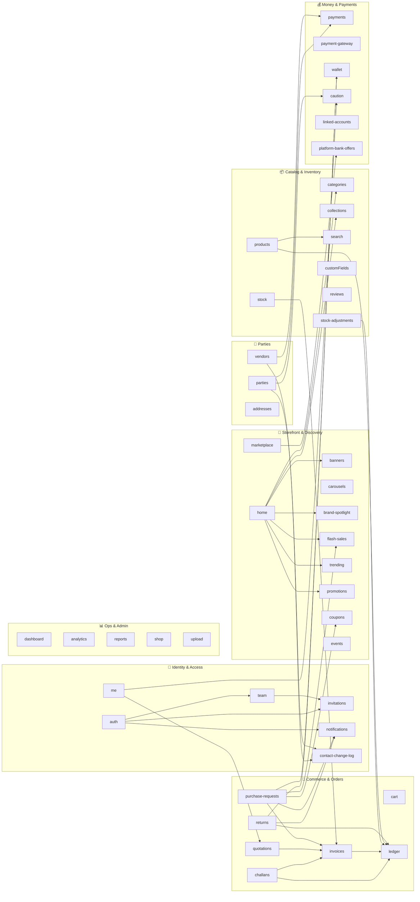

# Backend Module Map

45 modules under `backend/src/modules/`. Each module is a `*.service.ts` (business logic)
plus its controller/routes. The diagram below shows **actual service-to-service
dependencies** (derived from imports of `*.service.js`), grouped by domain.

`A --> B` means **A's service imports B's service**. Modules with no arrows are
self-contained (they only touch Prisma + shared helpers).

## Notes

- **`ledger` is the money hub** — `invoices`, `challans`, `products`, `returns`, and
  `stock-adjustments` all post into it. Treat it as the source of truth for balances.
- **`invoices` is the order hub** — `quotations`, `challans`, `stock`, and
  `purchase-requests` all converge on it (accept-a-quote / fulfil-a-challan →
  confirmed invoice).
- **`home`** is a pure read-aggregator (fans out to every storefront-surface module);
  it produces no writes.
- **`purchase-requests`** and **`returns`** are the heaviest fan-out writers — they
  touch coupons/flash-sales, invoices, wallet, and notifications.
- Standalone modules (no service-to-service edges): `addresses`, `analytics`,
  `cart`, `carousels`, `categories`, `customFields`, `dashboard`, `events`,
  `linked-accounts`, `payment-gateway`, `reports`, `reviews`, `shop`, `upload`,
  plus all the leaf storefront modules.
